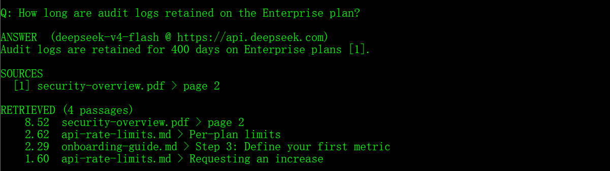
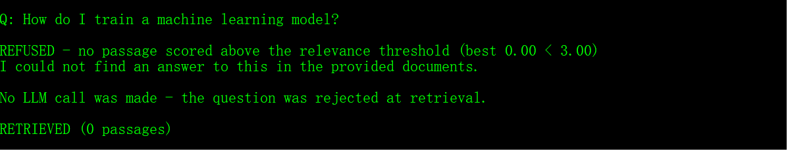
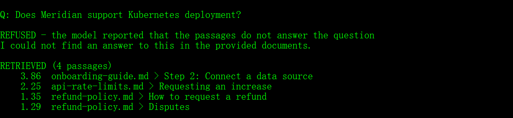
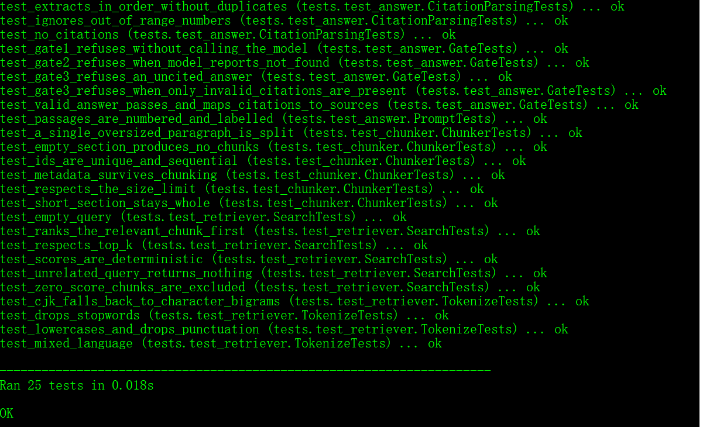

# Document Q&A — Answers With Sources, Or No Answer At All

Ask questions about your own documents. Every answer cites the file and section
it came from. When the documents don't contain the answer, the system says so
instead of inventing one.

Ships with a small sample corpus (3 Markdown files and a PDF) so it runs out of
the box.

---

## The problem this is built around

Most RAG demos show the happy path: a question the documents answer. That is the
easy half. The half that decides whether a client can actually deploy the thing
is what happens when the answer *isn't* in the documents — because a fluent,
confident, wrong answer is worse than no answer.

So there are three independent gates between a question and an answer. Any one
of them refuses.

| Gate | Check | Cost when it fires |
| --- | --- | --- |
| 1. Relevance | Best retrieved passage scores below a threshold | **No LLM call at all** |
| 2. Model judgement | Model reports the passages don't answer the question | One call |
| 3. Citation | Answer cites no valid passage → treated as invented | One call |

Gate 3 matters more than it looks. An answer with no citation is
indistinguishable from a hallucination, so it is handled as one rather than
shown to the user.

---

## Quick start

```bash
pip install -r requirements.txt
python ingest.py
python ask.py "How long do I have to request a refund on a monthly plan?"
```

No API key? Everything except the natural-language generation still runs:

```bash
python ask.py "How long do I have to request a refund?" --provider stub
```

---

## What a run looks like

**Answered, with a source:**

```
Q: What are the API rate limits on the Growth plan?

ANSWER  (deepseek-v4-flash @ https://api.deepseek.com)
The Growth plan allows 600 requests per minute and 1,000,000 requests per
day, with a burst ceiling of 1,200 [1]. Limits are enforced per API key
rather than per account [1].

SOURCES
  [1] api-rate-limits.md > Per-plan limits

RETRIEVED (4 passages)
    5.78  api-rate-limits.md > Per-plan limits
    1.94  api-rate-limits.md > Requesting an increase
```

A real run against the sample PDF — the citation resolves to a page number, so
the claim can be checked at the source:



**Refused at gate 1 — the corpus has nothing close, so no tokens are spent:**

```
Q: How do I train a machine learning model?

REFUSED - no passage scored above the relevance threshold (best 0.00 < 3.00)
I could not find an answer to this in the provided documents.

No LLM call was made - the question was rejected at retrieval.
```



**Refused at gate 2 — retrieval was fooled, judgement was not:**

```
Q: Does Meridian support Kubernetes deployment?

REFUSED - the model reported that the passages do not answer the question
I could not find an answer to this in the provided documents.

RETRIEVED (4 passages)
    3.95  onboarding-guide.md > Step 2: Connect a data source
```



That third case is the interesting one. The passage says *"Meridian **support**s
PostgreSQL, MySQL, Snowflake…"* — enough lexical overlap to clear the relevance
gate, nothing to do with Kubernetes. Keyword scoring alone would have answered
it. This is exactly why one gate isn't enough.

---

## Retrieval: BM25, not embeddings

Deliberate choice:

- No embedding API, no vector database, no model download, no GPU
- Runs fully offline and costs nothing per query
- **Scores are deterministic**, which is what makes retrieval unit-testable —
  most RAG codebases can't test this layer at all
- CJK is handled with character bigrams, so Chinese documents work without
  adding a segmenter

A vector retriever drops in behind the same `search()` signature when a project
genuinely needs semantic matching. For manuals, policies and contracts —
where users search with the document's own vocabulary — BM25 is competitive and
far cheaper to run.

---

## Swapping LLM provider

The client is plain OpenAI-compatible HTTP, so provider is configuration:

```yaml
# DeepSeek (default)
llm:
  base_url: https://api.deepseek.com
  model: deepseek-v4-flash
  api_key_env: DEEPSEEK_API_KEY

# OpenAI
llm:
  base_url: https://api.openai.com/v1
  model: gpt-4o-mini
  api_key_env: OPENAI_API_KEY
```

No code changes, no vendor lock-in.

---

## Citations point somewhere checkable

Markdown is split on headings and PDFs on pages, so a citation names a place a
human can actually open:

```
[1] refund-policy.md > Standard refunds
[2] security-overview.pdf > page 2
```

Use `--show-passages` to print the retrieved text alongside the answer, so every
claim can be verified against the source.

---

## Tuning

```yaml
retrieval:
  top_k: 4
  min_score: 3.0   # raise to refuse more, lower to answer more

chunking:
  max_chars: 900
  overlap_chars: 150
```

`min_score` is the precision/recall dial. Set it from what real questions score
against a real corpus — too high refuses valid questions, too low lets weak
matches through to gate 2 and costs tokens.

---

## Layout

```
ingest.py           build the index from docs/
ask.py              ask a question
config.yaml         documents, chunking, retrieval, provider
docs/               sample corpus (3 .md + 1 .pdf)
src/
  loaders.py        markdown headings / PDF pages -> Sections
  chunker.py        paragraph-aware splitting with overlap
  retriever.py      BM25, with CJK bigram support
  index.py          plain-JSON index, diffable and inspectable
  llm.py            OpenAI-compatible client + offline stub
  answer.py         prompt, the three gates, citation mapping
tests/              25 unit tests, no network required
```

```bash
python -m unittest discover -s tests -t . -v
```



The gate tests assert that gate 1 refuses **without the model being called at
all** — the fake client counts its invocations.
